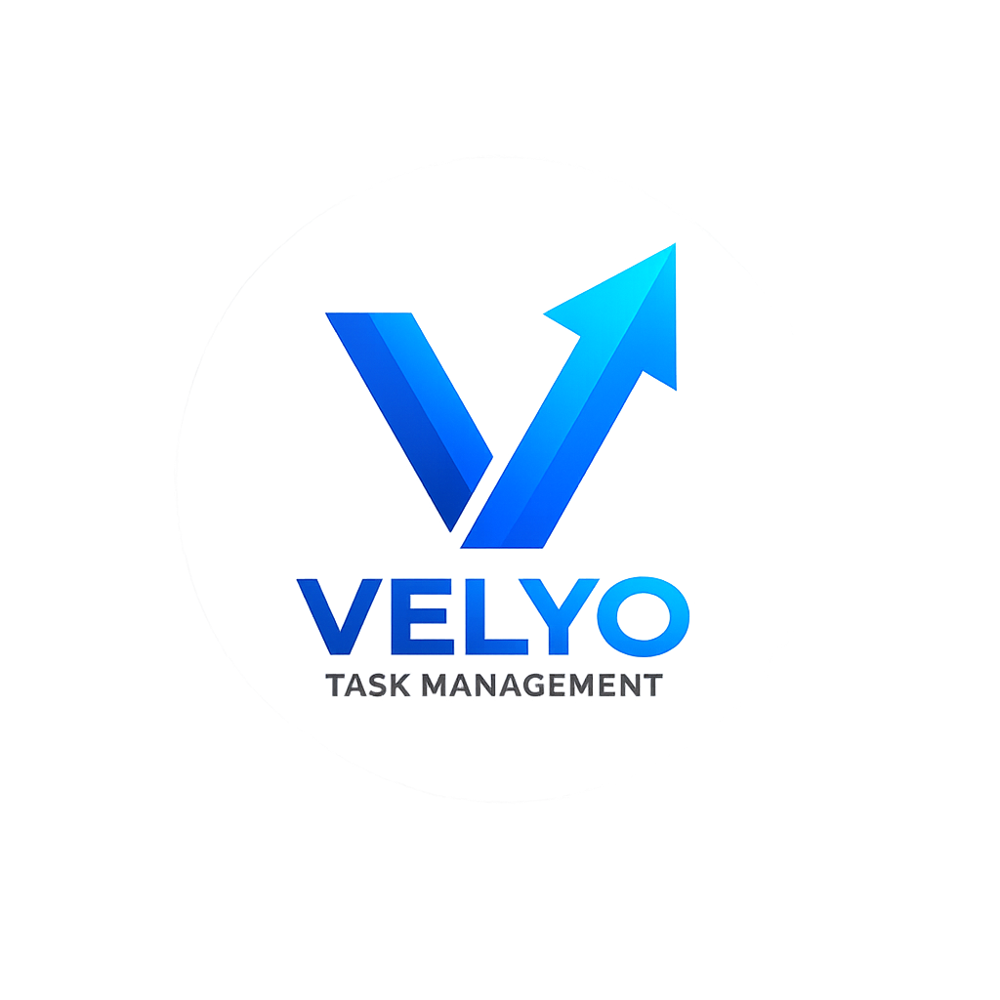
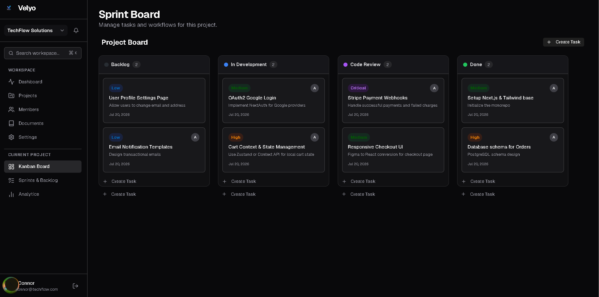
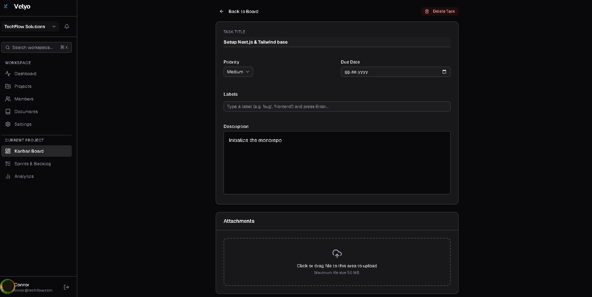
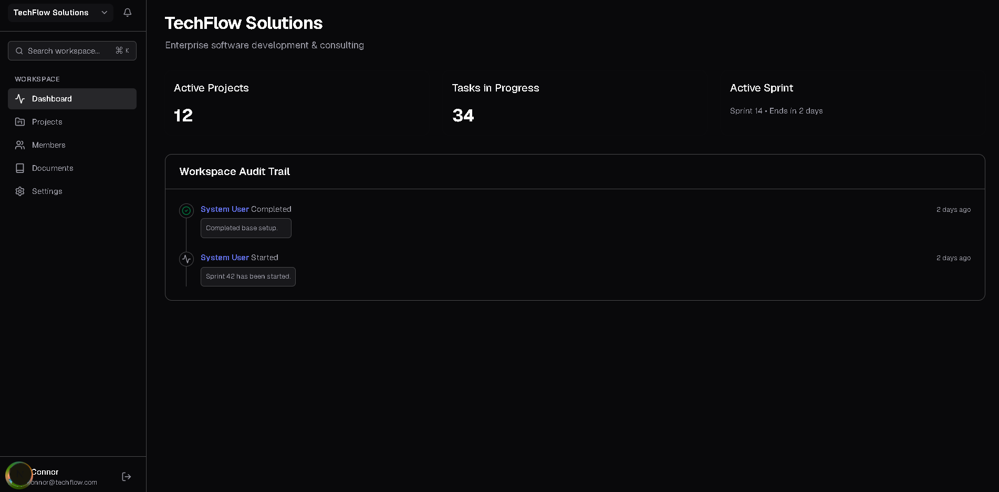
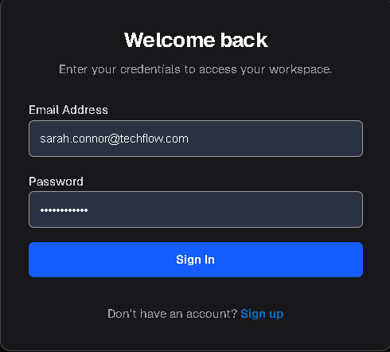
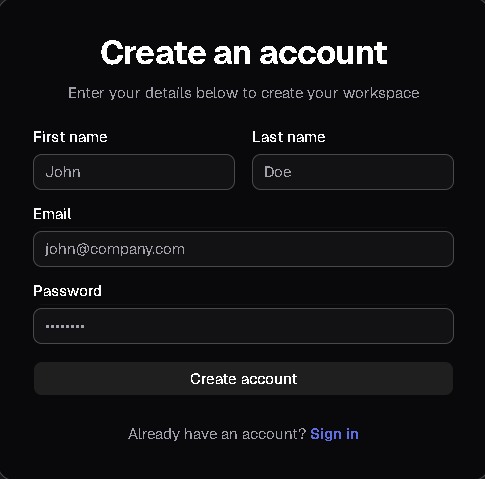

<div align="center">
  

  <h1>🚀 Velyo (TaskFlow Pro)</h1>
  <p><strong>Enterprise-Grade Agile Workspace & Real-Time Project Management Tool</strong></p>

  <p>
    <a href="#features">Features</a> •
    <a href="#tech-stack">Tech Stack</a> •
    <a href="#architecture">Architecture</a> •
    <a href="#screenshots">Screenshots</a> •
    <a href="#getting-started">Getting Started</a>
  </p>

  <p>
    
    
    
    
  </p>
</div>

---

## 📖 Overview

**Velyo** is a comprehensive, multi-tenant SaaS platform inspired by industry giants like Jira and Notion. It seamlessly combines agile project management (Sprints, Kanban, Sub-tasks) with a rich knowledge base (Documents). 

Designed with scalability in mind, it implements strict **Clean Architecture** on the backend and **Feature-Sliced Design (FSD)** on the frontend, featuring real-time data synchronization, advanced analytics, and custom workflow automations.

---

## ✨ Key Features

- **🎯 Agile Management:** Epics, Sub-tasks, custom Labels, and Sprint planning.
- **🔄 Real-Time Collaboration:** Instant UI updates across clients via WebSockets (SignalR) for tasks, comments, and notifications.
- **📝 Notion-Style Documents:** Block-based rich text editor (Tiptap) with markdown support.
- **⚙️ Customization:** Dynamic Custom Fields (JSONB) and Workflow States.
- **⏱️ Time Tracking:** Built-in worklog and time-tracking capabilities.
- **📊 Analytics:** Burndown charts, Cumulative Flow, and Sprint Velocity dashboards.
- **🔒 Enterprise Security:** Multi-tenant data isolation, JWT authentication, and Role-Based Access Control (RBAC).

---

## 📸 Screenshots


<details open>
<summary><b>1. Kanban Board & Agile Workflow</b></summary>
<br>
Drag & Drop enabled Kanban board showcasing priority badges, assignees, and real-time state transitions.

</details>

<details>
<summary><b>2. Task Details, Sub-tasks & Labels</b></summary>
<br>
Comprehensive task view including custom fields, time tracking, attachments, and real-time discussion threads.

</details>

<details>
<summary><b>3. Knowledge Base (Notion-style Editor)</b></summary>
<br>
Rich document editing experience with Tiptap, hierarchical document tree, and real-time saving.

</details>

<details>
<summary><b>4. Project Dashboard & Analytics</b></summary>
<br>
High-level overview of project health, sprint velocity, and burndown charts.

</details>

<details>
<summary><b>5. Authentication & Onboarding</b></summary>
<br>
Clean and secure Login and Registration pages.
<div style="display: flex; gap: 10px;">
  
  
</div>
</details>

---

## 🏗️ Architecture & Technical Decisions

### Backend (.NET 8 Web API)
- **Clean Architecture & DDD Lite:** Complete separation of concerns (Domain, Application, Infrastructure, Presentation).
- **CQRS Pattern:** Implemented via `MediatR` for separating read and write operations, improving scalability.
- **Outbox Pattern:** Ensuring eventual consistency and reliable event publishing for real-time notifications.
- **Database:** PostgreSQL (utilizing `text[]` for arrays and `jsonb` for dynamic custom fields). Entity Framework Core as ORM.

### Frontend (Next.js & React)
- **Feature-Sliced Design (FSD):** Highly modular and maintainable folder structure organized by business logic (`features/tasks`, `features/documents`, etc.).
- **State Management & Caching:** React Query (`@tanstack/react-query`) for server-state caching and Zustand for lightweight global UI state.
- **UI/UX:** Tailwind CSS v4, Radix UI primitives (`shadcn/ui`), and smooth drag-and-drop via `@hello-pangea/dnd`.
- **Validation:** Zod schemas combined with React Hook Form for type-safe inputs.

---

## 🚀 Getting Started

The entire infrastructure is containerized. You can spin up the application, database, and cache with a single command.

### Prerequisites
- [Docker](https://www.docker.com/) & Docker Compose
- Node.js 20+ (for local frontend development)
- .NET 8 SDK (for local backend development)

### Quick Start (Docker)

1. **Clone the repository:**
   ```bash
   git clone [https://github.com/ozaycank/Velyo.git](https://github.com/ozaycank/Velyo.git)
   cd Velyo
   
   Spin up the infrastructure:
   docker-compose up -d --build

   Access the Application:
   Web UI: http://localhost:3000
   API Swagger UI: http://localhost:5000/swagger
   
### 📜 License
This project is for portfolio and demonstration purposes.

Designed & Developed with ❤️ by [[ozaycank](https://github.com/ozaycank)]